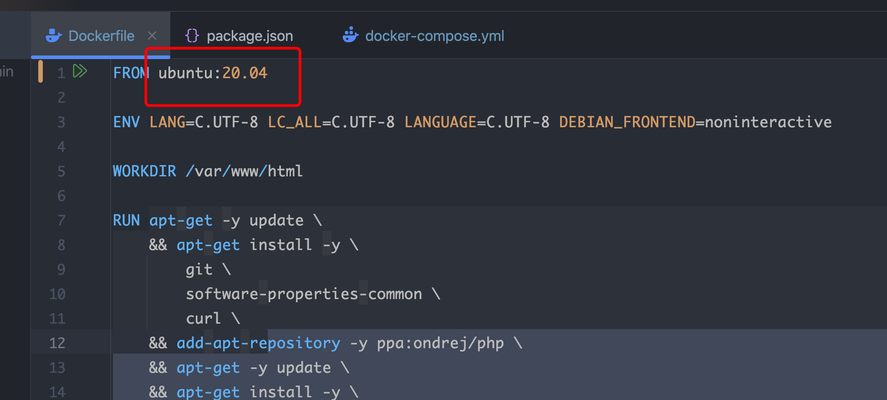
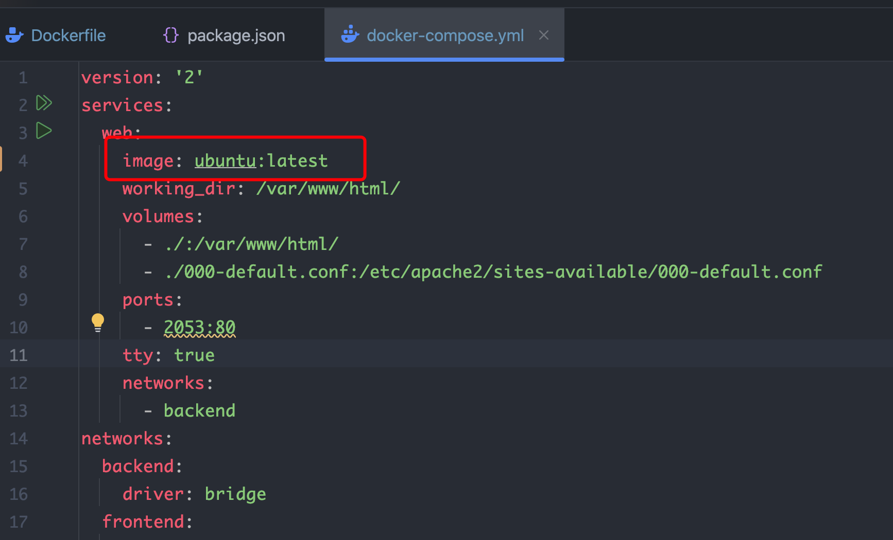

## Docker 安装 之 Mac10.15 的操作流程

### docker desktop 安装链接

1. [dockerDesktop 4.15.0](https://desktop.docker.com/mac/main/amd64/93002/Docker.dmg)

2. 打开 docker, 执行如下命令


```shell
 docker ps -a
```

3. 执行 docker build -t shopify .

这里报错 amd64 文件

### 尝试解决方案一

修改 image 版本

设置后执行 build 操作, 依然报错 <br>

### 尝试解决方案二

执行如下命令, 拉取 amd64 image

```shell
docker pull --platform linux/amd64 ubuntu:20.04

docker images
```


这里会显示 Image , 再次运行 build 依然报错

### 尝试解决方案三 docker-compose

:::warning
Docker-Compose 项目是 Docker 官方的开源项目，负责实现对 Docker 容器集群的快速编排。<br>
Docker-Compose 将所管理的容器分为三层，分别是工程（project），服务（service）以及容器（container）。Docker-Compose 运行目录下的所有文件（docker-compose.yml，extends 文件或环境变量文件等）组成一个工程，若无特殊指定工程名即为当前目录名。一个工程当中可包含多个服务，每个服务中定义了容器运行的镜像，参数，依赖。 <br>
Docker-Compose 通过一个配置文件来管理多个 Docker 容器，在配置文件(docker-compose.yml)中，所有的容器通过 services 来定义，然后使用 docker-compose 脚本来启动，停止和重启应用，和应用中的服务以及所有依赖服务的容器，非常适合组合使用多个容器进行开发的场景。
:::

运行以下命令:

```shell
// 安装
sudo curl -L "https://github.com/docker/compose/releases/download/1.29.2/docker-compose-$(uname -s)-$(uname -m)" -o /usr/local/bin/docker-compose

// 修改权限
sudo chmod +x /usr/local/bin/docker-compose

// 验证是否安装成功
docker-compose --version
```

接下来修改以下文件:


启动定义的 docker-compose 服务:

```shell
docker-compose up -d
```


接下来执行: <br>

```shell
docker-compose exec web /bin/bash
// docker-compose exec 是 Docker Compose 提供的一个命令，用于在运行中的服务容器内执行命令。
// /bin/bash 是大多数 Linux 发行版中的默认 shell，提供了一个命令行界面，允许用户以命令行的方式与操作系统交互
```

至此 docker 容器运行并连接成功 <br>
下面进行容器的的 update 和 package install <br>

```shell
apt-get -y update \
    && apt-get install -y \
        git \
        software-properties-common \
        curl \
    && add-apt-repository -y ppa:ondrej/php \
    && apt-get -y update \
    && apt-get install -y
        libbz2-dev \
        libfreetype6-dev \
        libjpeg-dev \
        libmcrypt-dev \
        libpng-dev \
        libssl-dev \
        unzip \
        openssl \
        sshpass \
        php7.4 \
        php7.4-common\
        php7.4-gd \
        php7.4-xml \
        php7.4-zip \
        php7.4-curl \
        php7.4-mysql \
        php7.4-sqlite3 \
        php7.4-mbstring \
        php7.4-bcmath \
        php7.4-gmp \
        php-xdebug \
        php-mongodb \
        supervisor \
```

注意: <br>

```shell
add-apt-repository -y ppa:ondrej/php
```

安装相关包前要检查 repo 是否正确

### docker 内部执行指令

```shell
启动apache2服务 :
apt-get install -y apache2
service apache2 status
service apache2 start
cat /etc/apache2/sites-available/000-default.conf

# 一 更换版本
1. update-alternatives --set php /usr/bin/php7.4
2. service apache2 status

# 二  查看http://localhost:2053
cat /etc/apache2/sites-available/000-default.conf

# 更新环境
ssh 连接 开发环境主机:
chmod 600 /Users/xxxx/Downloads/johnson/Pem/SPM-Stage.pem

ssh -i /Users/xxxx/Downloads/johnson/Pem/xxx.pem ubuntu@dns域名

# 跑批任务 php schedule :

sudo crontab -e
php artisan schedule:run
php artisan -v

# 更新代码仓库时需要执行两部:
git pull
sudo supervisorctl restart horizon ( 主要是更新redis栈存)

# laravel 电商订单管理后台测试站:
https://tw-stage-admin.welltivity.com/admin/auth/login
# laravel 电商订单管理后台正式站:
https://tw-admin.welltivity.com/admin/auth/login
# laravel 电商订单管理后台开发站:
https://tw-develop-admin.welltivity.com/admin/auth/login (不维护)

# 电商建置平台管理端
https://admin.shopify.com/login?errorHint=no_identity_session

# 电商建置平台前台(由管理端定制化生成)
https://tw.welltivity.com/

# gmail
johnsonfitness2019@gmail.com - Johnsonfitness2019

# DB开发环境
DB_CONNECTION=mysql
DB_HOST=spm-staging-mariadb.cfeqvo0govkf.ap-northeast-1.rds.amazonaws.com
DB_PORT=3306
DB_DATABASE=stage
DB_USERNAME=admin
DB_PASSWORD=IQQol6bYQH9YNK1Kb4FD

# DB正式环境
DB_CONNECTION=mysql
DB_HOST=spm-production-mariadb.cfeqvo0govkf.ap-northeast-1.rds.amazonaws.com
DB_PORT=3306
DB_DATABASE=shopifyadmin
DB_USERNAME=admin
DB_PASSWORD=noKonUBQngRdHS4UichT

# composer json
删除一个依赖:
"masbug/flysystem-google-drive-ext": "^1.0.0"


```
